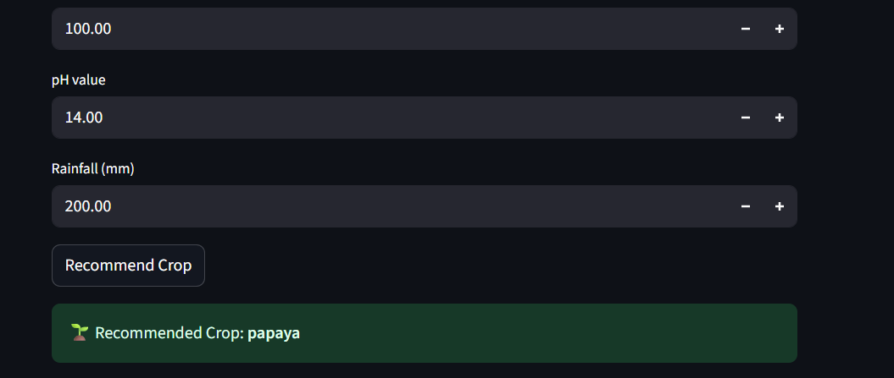
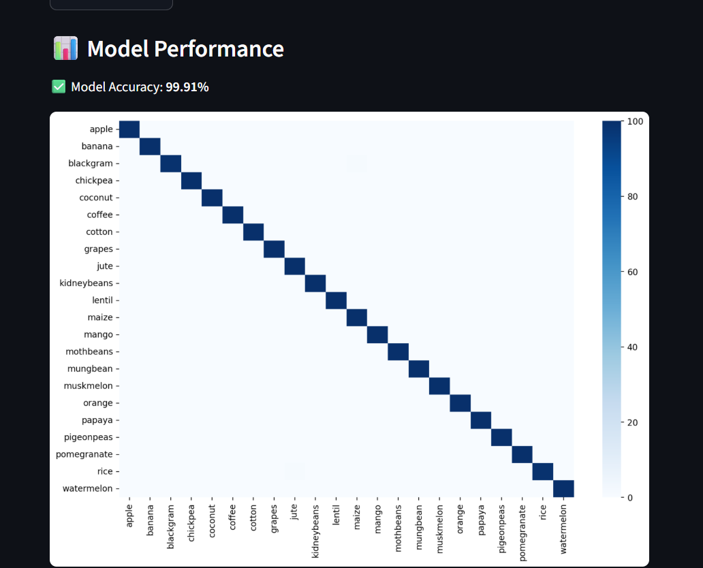

# Crop Recommendation System 🌾

A **Python-based ML project** that predicts the most suitable crop to grow based on soil and weather parameters.

## ✅ Project Overview

This system uses machine learning to recommend crops based on:

- Soil nutrients: **N, P, K**
- Weather conditions: **Temperature, Humidity, Rainfall**
- Soil pH

The model is trained on real crop data to help farmers and agriculturists make informed decisions.

## ✨ Features

- 🌱 Predicts the best crop based on soil & weather data
- 📊 Displays model performance (accuracy, confusion matrix)
- 💻 Optional web interface using Streamlit/Flask
- ⚡ Easy to run and extend

## 🛠 Technology Stack

- **Language:** Python 3.x  
- **Libraries:** `pandas`, `scikit-learn`, `joblib`, `numpy`, `matplotlib`, `seaborn`, `streamlit`  
- **IDE:** VS Code  
- **Optional Web Interface:** Streamlit / Flask  

## 📂 Project Structure
can i

crop-recommendation-system/
│
├─ src/
│   ├─ train\_model.py      # Trains ML model
│   └─ predict.py          # Predicts crop from user input
│
├─ models/                 # Saved ML models & encoders
│   ├─ rf\_crop\_model.joblib
│   ├─ scaler.joblib
│   ├─ label\_encoder.joblib
│   └─ feature\_names.joblib
│
├─ data/
│   └─ crop\_data.csv       # Dataset
│
├─ venv/                   # Virtual environment
├─ app.py                  # Optional web interface
├─ requirements.txt        # Dependencies
└─ README.md

## ⚡ How to Run

### 1. Clone the repository

git clone <your-repo-link>
cd crop-recommendation-system

### 2. Create and activate virtual environment

python -m venv venv
# Windows
venv\Scripts\activate
# Linux/Mac
source venv/bin/activate

### 3. Install dependencies

pip install -r requirements.txt

### 4. Train the model (optional)

python src/train_model.py

### 5. Make predictions via CLI

python src/predict.py <N> 
 <K> <temperature> <humidity> <ph> <rainfall>

**Example:**

python src/predict.py 50 40 39 398 100 14 200

**Output:**

Recommended Crop: Papaya

### 6. Run the Streamlit Web App (optional)

streamlit run app.py

## 🌟 App Preview

### 1. Input Screen

### 2. Prediction Result

### 3. Model Metrics

## 📈 Model Performance

* Displays **accuracy** and **confusion matrix**.
* Helps verify model predictions visually.

## 📌 Future Enhancements

* Web interface for easy input (Streamlit/Flask)
* Include more environmental parameters like sunlight, wind
* Model improvements with larger datasets

## 📜 License

MIT License

