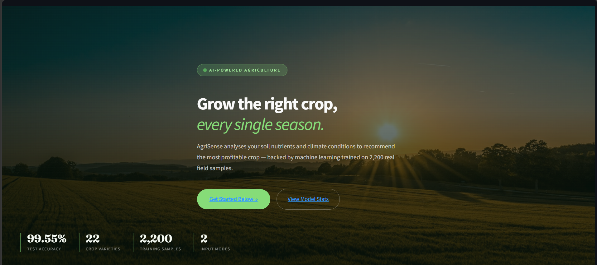
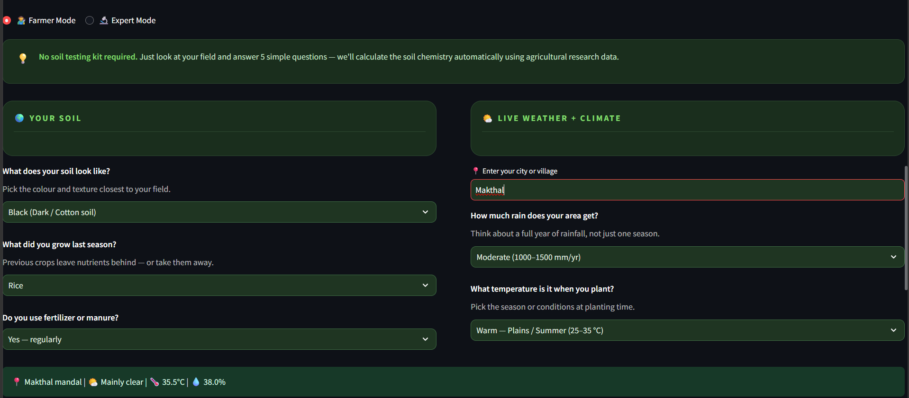
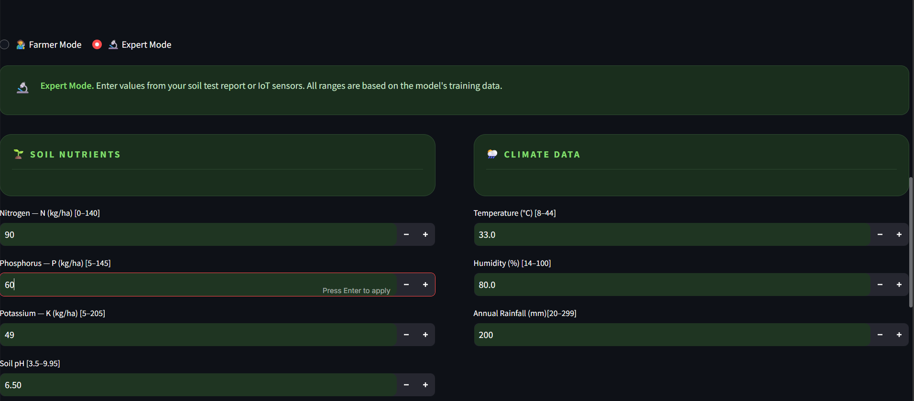
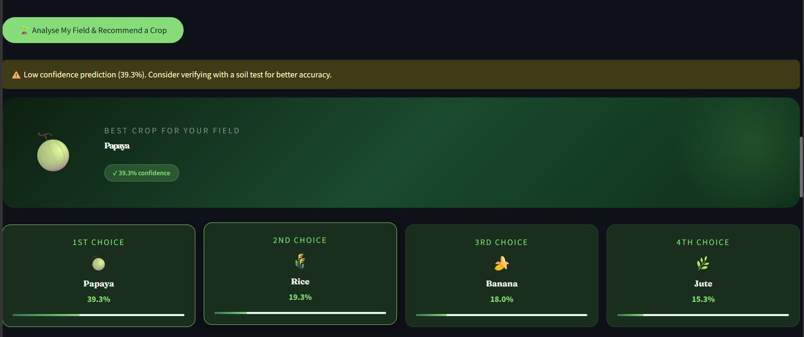
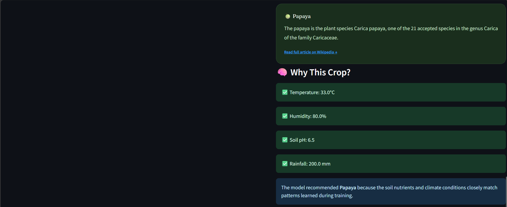

# 🌾 AgriSense — Crop Recommendation System


## 🔴 Live Demo

**[vanivarun-crop-recommendation-system-app-uludgu.streamlit.app](https://vanivarun-crop-recommendation-system-app-uludgu.streamlit.app)**

## 📖 Overview

AgriSense recommends the best crop for a field using a Random Forest model trained on 2,200 soil and climate samples covering 22 crop varieties. It offers two ways in: a Farmer Mode that needs no soil test, and an Expert Mode for exact lab values, both feeding live weather data into the same prediction pipeline.

## 🖼️ Application Screenshots

### 🚀 Landing Page



Modern landing page with AgriSense branding, AI-powered crop intelligence, live weather integration, and dual user workflows.

### 🌱 Farmer Mode + Weather Integration



Designed for farmers without soil test reports. Users answer simple field-related questions while live weather data is automatically fetched using Open-Meteo and Nominatim APIs.

### 🧪 Expert Mode



Advanced mode for agricultural experts and users with soil test reports. Supports direct entry of Nitrogen (N), Phosphorus (P), Potassium (K), pH, temperature, humidity, and rainfall values.

### 🎯 Crop Recommendation Results



Displays the recommended crop, confidence score, top alternative crops, probability rankings, and confidence-based decision support.

### 🧠 AI Recommendation Explanation



Explains why the crop was recommended using temperature, humidity, rainfall, soil pH, and nutrient conditions along with additional crop information.


## ✨ Features

- **Farmer Mode** — five plain-language questions (soil look, last season's crop, fertilizer use, rainfall, planting temperature) automatically converted into soil nutrient estimates, no lab report required.
- **Expert Mode** — direct numeric entry of N, P, K, pH, temperature, humidity, and rainfall for users with exact soil test or sensor data.
- **Live weather auto-fill** — typing a city/village name geocodes it via Nominatim and pulls live temperature, humidity, and rainfall from Open-Meteo.
- **Top-4 ranked predictions** with confidence percentages and confidence-tiered warnings (low/moderate confidence banners).
- **Wikipedia-enriched results** — the predicted crop's description and image are pulled from the Wikipedia REST API, with static fallback text/images if a lookup fails.
- **Input validation** against the model's actual training ranges, with clear out-of-range error messages.
- **In-app model analytics** — live test accuracy, a feature importance bar chart, and a normalized confusion matrix heatmap.
- **Performance caching** — model artifacts (`st.cache_resource`), weather lookups, and Wikipedia lookups (`st.cache_data`, 24h TTL) are all cached to avoid redundant API calls.

## 🧠 ML Pipeline

| Step | Detail | Why It Matters |
|---|---|---|
| Data split | `train_test_split` with `test_size=0.2`, `stratify=y_enc`, `random_state=42`, performed before any scaling | Prevents the test set from leaking into training |
| Feature scaling | `StandardScaler` fit only on the training split, then applied to both train and test | Test data never influences the scaler, keeping evaluation honest |
| Label encoding | `LabelEncoder` maps 22 crop names to integer classes | Required for scikit-learn's classifier interface |
| Hyperparameter search | 5-fold `cross_val_score` across `n_estimators` ∈ `[100, 150, 200]` | Selects tree count by validated accuracy instead of guessing |
| Model | `RandomForestClassifier(n_estimators=best_n, random_state=42, n_jobs=-1)` | Captures non-linear soil/climate interactions and yields feature importances |
| Evaluation | Accuracy score, classification report, and confusion matrix on the held-out test set | Confirms performance on data the model never trained on |
| Artifact export | Model, scaler, label encoder, feature names, confusion matrix, and test accuracy saved via `joblib` | Lets `app.py` load a trained model instantly without retraining |

## 🛠️ Tech Stack

| Tool | Version | Purpose |
|---|---|---|
| Streamlit | 1.41.1 | Web app framework and UI |
| scikit-learn | 1.5.2 | RandomForestClassifier, StandardScaler, LabelEncoder, train/test split |
| pandas | 2.2.3 | Tabular data handling for training and inference |
| NumPy | 1.26.4 | Numerical operations |
| joblib | 1.4.2 | Saving and loading model artifacts |
| matplotlib | 3.9.4 | Feature importance chart |
| seaborn | 0.13.2 | Confusion matrix heatmap |
| requests | 2.31.0 | Calls to Nominatim, Open-Meteo, and Wikipedia APIs |
| pytest | 8.3.4 | Test suite |

## 📁 Project Structure

```
crop-recommendation-system/
├── app.py                  # Streamlit UI — Farmer/Expert modes, predictions, analytics
├── requirements.txt
├── src/
│   ├── train_model.py      # Training pipeline: split → scale → CV → fit → export
│   ├── predict.py          # Loads artifacts, validates inputs, returns top-N predictions
│   └── weather.py          # Nominatim geocoding + Open-Meteo weather fetch (cached 24h)
├── data/
│   └── crop_data.csv       # Training dataset (2,200 samples, 22 crop classes)
└── models/                 # Trained artifacts generated by train_model.py
    ├── rf_crop_model.joblib
    ├── scaler.joblib
    ├── label_encoder.joblib
    ├── feature_names.joblib
    ├── confusion_matrix.joblib
    └── test_accuracy.joblib
```

## ⚙️ Installation & Setup

1. Clone the repository
   ```bash
   git clone https://github.com/vanivarun/crop-recommendation-system.git
   cd crop-recommendation-system
   ```

2. Create and activate a virtual environment
   ```bash
   python -m venv venv
   source venv/bin/activate   # Windows: venv\Scripts\activate
   ```

3. Install dependencies
   ```bash
   pip install -r requirements.txt
   ```

4. (Optional) Retrain the model — pretrained artifacts are already included in `models/`
   ```bash
   python src/train_model.py
   ```

5. Run the app
   ```bash
   streamlit run app.py
   ```

## 🚀 Usage

Open the app and choose **Farmer Mode** or **Expert Mode** at the top. In Farmer Mode, answer the soil and weather questions (or type a city name to auto-fill live weather); in Expert Mode, enter exact N/P/K/pH/temperature/humidity/rainfall values. Click **Analyse My Field & Recommend a Crop** to get the top-4 ranked crop predictions with confidence scores, a Wikipedia summary of the top result, and an input summary table.

## 🌦️ Weather Integration

```
 City Name
     │
     ▼
 Nominatim (geocoding)
     │
     ▼
 lat / lon
     │
     ▼
 Open-Meteo (forecast API)
     │
     ▼
 temperature, humidity, rainfall
     │
     ▼
 RandomForestClassifier
```

Both APIs are free and require no API key; results are cached for 24 hours per city to avoid redundant calls.

## 📊 Model Performance

| Metric | Value | Notes |
|---|---|---|
| Test Accuracy | 99.55% | Reported in-app, evaluated on the held-out 20% test split |
| Crop Classes | 22 | Distinct crop labels the model can predict |
| Training Samples | 2,200 | Total rows in `crop_data.csv` |
| Algorithm | Random Forest | `n_estimators` selected via 5-fold cross-validation |

## 🎓 Interview Talking Points

> "I built AgriSense with two real input paths — a Farmer Mode that needs no soil test and an Expert Mode for exact lab values — both feeding the same Random Forest model, which I validated with a stratified train/test split and five-fold cross-validation to avoid data leakage. I also wired in live weather through Nominatim and Open-Meteo so the location someone types actually changes the prediction, and I exposed the model's own feature importances and confusion matrix in the UI instead of hiding them. That combination of real-world usability and transparent evaluation is what separates it from a basic notebook-to-Streamlit port."

## 🗺️ Roadmap

- ✅ Random Forest classifier with CV-tuned hyperparameters
- ✅ Farmer Mode and Expert Mode input paths
- ✅ Live weather auto-fill via Nominatim + Open-Meteo
- ✅ Wikipedia-enriched crop results with fallback text/images
- ✅ Confidence-tiered prediction warnings
- ✅ In-app feature importance chart and confusion matrix
- ✅ Cached model loading and API calls
- ⬜ Multi-language support for Farmer Mode questions
- ⬜ Soil photo upload with computer-vision-based estimation
- ⬜ Historical yield tracking per field
- ⬜ Mobile-optimized PWA version

## 👤 Author

**Vani Varun**
GitHub: [github.com/vanivarun/crop-recommendation-system](https://github.com/vanivarun/crop-recommendation-system)
Live App: [vanivarun-crop-recommendation-system-app-uludgu.streamlit.app](https://vanivarun-crop-recommendation-system-app-uludgu.streamlit.app)
